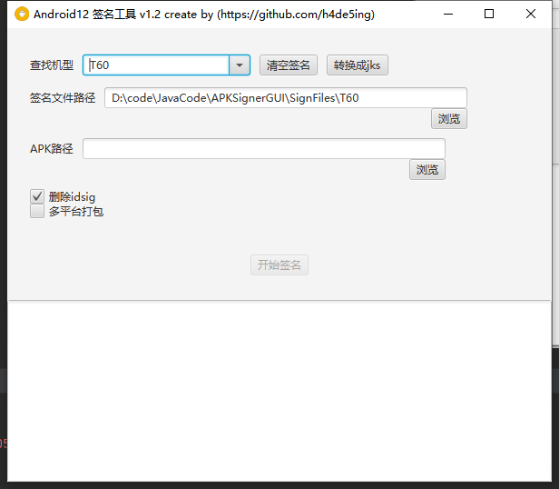
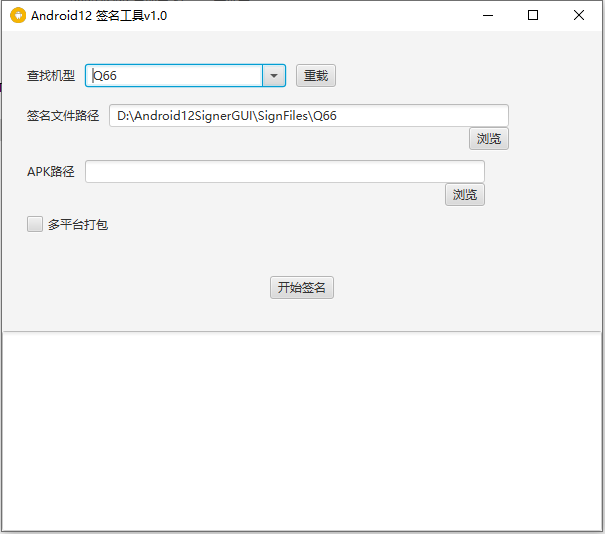

## Android 12签名工具

- ~~通过zipalign.exe自动对齐APK~~
- 通过apksigner进行v1 v2签名
- 批量进行多平台签名
- 采用platform.pk8和platform.x509.pem 进行签名
- v1.2增加工具授权使用
- 增加pk8和pem转换成jks

## TODO 　
- [ ] 增加备用节点服务
- [ ] 增加服务器端运行，支持接口自动签名升级app
- [ ] apk新版本接口，如果服务器端没有apk，需要待添加
- [ ] 上传新平台的签名
- [ ] 上传未签名apk接口
- [ ] webhook 从git服务器拉去apk
- [ ] jks签名文件支持- [ ] v1 v2 v3 v4支持
- [x] 增加platform.x509.pem签名信息查看
- [ ] 增加apk信息查看[apk签名v1 v2,版本号,版本名,文件大小,...]
- [ ] P2P 节点分发数据

